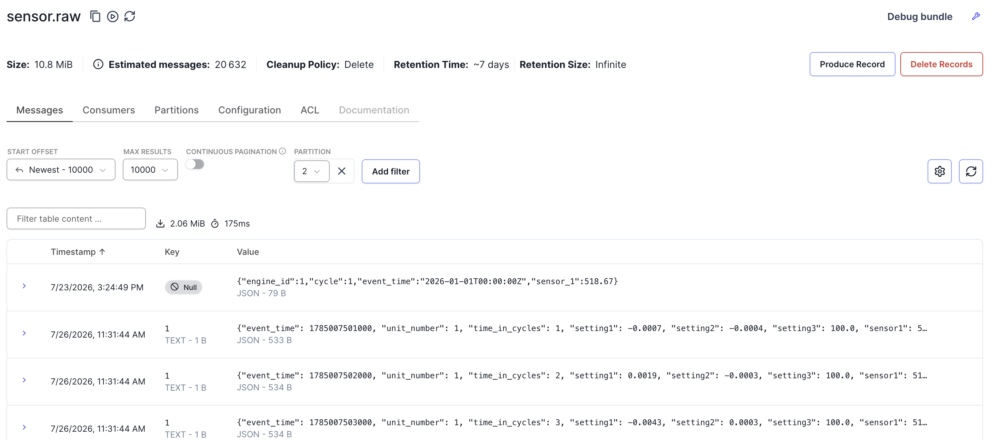

# train_FD001 raw
Top 3 rows in train_FD001.txt
unit, cycle, op_setting 1/2/3, sensor_1/2/.../21
```
1	1	-0.0007	-0.0004	100.0	518.67	641.82	1589.70	1400.60	14.62	21.61	554.36	2388.06	9046.19	1.3	47.47	521.66	2388.02	8138.62	8.4195	0.03	392	2388	100.0	39.06	23.4190	NaN	NaN
1	2	0.0019	-0.0003	100.0	518.67	642.15	1591.82	1403.14	14.62	21.61	553.75	2388.04	9044.07	1.3	47.49	522.28	2388.07	8131.49	8.4318	0.03	392	2388	100.0	39.00	23.4236	NaN	NaN
1	3	-0.0043	0.0003	100.0	518.67	642.35	1587.99	1404.20	14.62	21.61	554.26	2388.08	9052.94	1.3	47.27	522.42	2388.03	8133.23	8.4178	0.03	390	2388	100.0	38.95	23.3442	NaN	NaN
```

20631 rows altogether

sensor1 是风扇入口温度,sensor2 是低压压缩机出口温度……它们语义各不相同、单位不同、

Unique value count per column
col unit_number: 100 unique values
col time_in_cycles: 362 unique values
col op_setting_1: 158 unique values
col op_setting_2: 13 unique values
col op_setting_3: 1 unique values
col sensor_1: 1 unique values
col sensor_2: 310 unique values
col sensor_3: 3012 unique values
col sensor_4: 4051 unique values
col sensor_5: 1 unique values
col sensor_6: 2 unique values
col sensor_7: 513 unique values
col sensor_8: 53 unique values
col sensor_9: 6403 unique values
col sensor_10: 1 unique values
col sensor_11: 159 unique values
col sensor_12: 427 unique values
col sensor_13: 56 unique values
col sensor_14: 6078 unique values
col sensor_15: 1918 unique values
col sensor_16: 1 unique values
col sensor_17: 13 unique values
col sensor_18: 1 unique values
col sensor_19: 1 unique values
col sensor_20: 120 unique values
col sensor_21: 4745 unique values

# config docker-compose.yml
follow Redpanda docker compose labs recommendation and picked the one using single broker w/ console in docker

as I set console is `http://localhost:8080`, I can view the json msg queued to the topic

The topic is made with 3 partitions because:
- 大于 1，才能演示 key 到分区的哈希分配。单分区的话所有消息都在一个地方，看不出 keyed 的效果
- 小到本地跑得动，Console 里三个分区一眼扫完
- 后面 Spark 的并行度会对齐分区数，3 个 task 足够演示又不会把笔记本压垮

rpk topic consume 默认不提交 consumer group offset, 不会影响真正的consuemrs

# steps
```
─❯ docker compose up -d # start the docker services
─❯ python producer/replay.py # test replay
```

topic 是持久追加的,one manual test message which not follows the msg format in CMAPSSData caused key value err,schema 不一致。即使在console读过, 也不会清楚, 且console consume不移动offset
这正是 phase 1 计划里 Protobuf + schema registry 要解决的问题. 有了 schema 校验,那条 engine_id 格式的消息根本进不来。


# day 2
producer __init__.py and replay.py

## verifications 1, all units of the same key falls into the same partitions
## vf2, event_time increase as cycle inscreases
## vf3, check total count adds up to 20631 (8725+7894+4012)
```bash
╰─❯ docker exec -it redpanda-0 rpk topic consume sensor.raw -p 0 --offset start -n 5 -f '%k\n'
7
7
7
7
7
...
╰─❯ docker exec -it redpanda-0 rpk topic consume sensor.raw --offset start -n 3 \
  -f '%v\n' | python -c "import sys,json; [print(json.loads(l)['unit_number'], json.loads(l)['time_in_cycles'], json.loads(l)['event_time']) for l in sys.stdin]"
1 1 1785007501000
1 2 1785007502000
1 3 1785007503000
...
╰─❯ docker exec -it redpanda-0 rpk topic describe sensor.raw -p
PARTITION  LEADER  EPOCH  REPLICAS  LOG-START-OFFSET  HIGH-WATERMARK
0          0       1      [0]       0                 8725
1          0       1      [0]       0                 7894
2          0       1      [0]       0                 4012
```

# todo

- Add `--chaos`
- 坏数据拦截验证